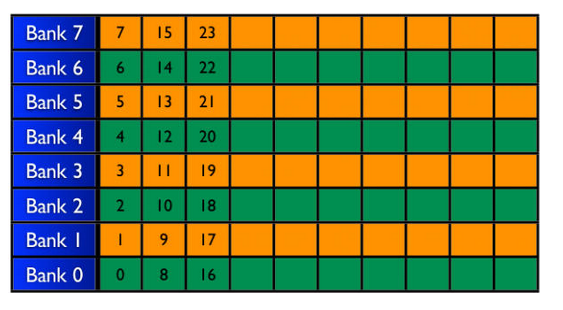
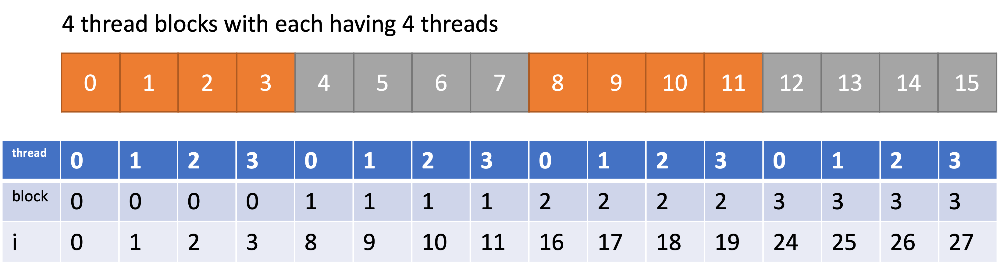

## cuda_reduction

An implementation of different kinds of reduction in cuda based on https%3A//github.com/guoruoqian/cudaReductionLearning.

### Reductions

1. Interleaved addressing with divergent branching
2. Interleaved addressing with bank conflicts
3. Sequential addressing
4. First add during global load
5. Unroll last warp
6. Completely unroll
7. Multiple elements per thread


#### Interleaved addressing with divergent branching
```c
if (tid % (2*s) == 0) {
    sdata[tid] += sdata[tid + s];
}
```

There is **Warp Divergence** in this case. One of the two threads in the same warp with consecutive thread ids will execute and the other "won't". All threads in the same warp will execute the same instrucitons. However the results from threads with odd thread id won't write the results back.

So, in this case, only **half of the warp** are actually contributing to the problem.


#### Interleaved addressing with bank conflicts
```c
for (unsigned int s = 1; s < blockDim.x; s *= 2) {
   int index = 2 * s * tid;
   if (index < blockDim.x) {
      sdata[index] += sdata[index + s];
   }
   __syncthreads();
}
```

In order to solve the problem above, `index` is changed so that every thread gets two elements to operate on.

```
previous (half warp):
element:    0     1    2    3 ...
threads: No.0  No.1 No.2 No.3 ...

now:
element:    0     1    2    3    4    5 ...
threads: No.0       No.1      No.2      ...
```

In this way, every thread in a warp can actually contributes to the problem. However, it will bring new problem called **bank conflits**.

##### Bank Conflict


This is the organization of shared memory. Shared memory are split into 8 banks (16 banks for newer GPU). Each bank has some depth, which means multiple data are stored in one bank. For example, `Bank 7` in the figure holds data, `7, 15, 23`. 

When threads in one warp try to access data in the shared memory, the access will be carried out twice in two half-warp. So, **bank conflict** happens when the threads in the same half-warp trying to access the **same bank** (not the same data). 

However, when multiple threads in the same half-warp try to access the same address in shared memory, it won't cause bank conflict. For example, `int number = data[3]`. Shared memory will broadcast this data to all threads trying to access this and hence no bank conflict.

##### static shared memory and dynamic shared memory
static: `__shared__ type data[SIZE]`

dynamic: `extern __shared__ type data[]`

#### Sequential addressing
```c
for (unsigned int s = blockDim.x/2; s > 0; s >>= 1) {
   if (tid < s) {
      sdata[tid] += sdata[tid + s];
   }
   __syncthreads();
}
```
In this case, threads access shared memory sequentially so that there won't be any bank conflicts.

#### First add during global load
```c
unsigned int i = threadIdx.x + blockIdx.x * 2 * blockDim.x;
sdata[tid] = g_idata[i] + g_idata[i+blockDim.x];
__syncthreads();

for (unsigned int s = blockDim.x/2; s > 0; s >>= 1) {
   if (tid < s) {
      sdata[tid] += sdata[tid + s];
   }
   __syncthreads();
}
```

In [sequential addressing](#sequential-addressing), only `s` threads are working. So, we can mannully carry out the first round while loading the data, which saves some efforts.



#### Unroll last warp
```c
__device__ void warpReduce(volatile int *sdata, int tid) {
   sdata[tid] += sdata[tid + 32];
   sdata[tid] += sdata[tid + 16];
   sdata[tid] += sdata[tid + 8];
   sdata[tid] += sdata[tid + 4];
   sdata[tid] += sdata[tid + 2];
   sdata[tid] += sdata[tid + 1];
}

for (unsigned int s = blockDim.x/2; s > 32; s >>= 1) {
   if (tid < s) {
    sdata[tid] += sdata[tid + s];
   }
   __syncthreads();
}

if (tid < 32) warpReduce(sdata, tid);
```

When `s = 32`, the rest operations will be carried out in one warp. In this case, there is no need for `__syncthreads()` and the rest of operations can be mannully unrolled. `32, 16, 8, 4, 2, 1`

##### volatile
Compiler might use register to facilitate the access of shared memory. 

`sdata[tid] += sdata[tid + 4]`: thread 0 writes result to register 0 and thread 2 writes result to register 2;

`sdata[tid] += sdata[tid + 2]`: thread 0 tries to access `sdata[2]`, but `sdata[2]` isn't updated since the actual result is still in the register.

#### Completely unroll
Use `template` to fully unroll the loop.

#### Multiple elements per thread
```c
unsigned int tid = threadIdx.x;
unsigned int i = blockIdx.x * blockDim.x * 2 + threadIdx.x;
unsigned int gridSize = blockDim.x * 2 * gridDim.x;

sdata[tid] = 0;
while (i < num_element) {
   sdata[tid] += d_idata[i] + d_idata[i + blockDim.x];
   i += gridSize;
}
__syncthreads();
```
This every much similar to [First add during global load](#first-add-during-global-load). However, instead of adding once, it tries to add as many as possible.